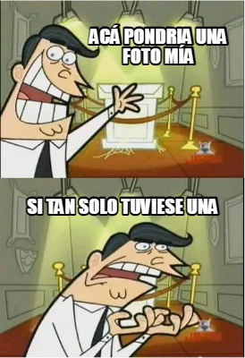

  # Lucas Santana
  ¡Hola! mi nombre es **Lucas Nahuel Santana**, tengo **25 años** y actualmente estoy cursando mi quinto cuatrimestre en la **Tecnicatura en programación**. Empecé mi vida universitaria cursando Diseño gráfico allá por 2017 en UAI para dejarlo 2 años despúes por disgustos que me había llevado con dicha facultad. Luego, en 2019 empecé a cursar Diseño gráfico en UM para NUEVAMENTE (jasdjkasjd) dejarlo tres años después pero esta vez por motivos económicos. En el año 2022 empecé la tecnicatura en programación en UNAHUR y no me arrepiento para nada, cada materia es un mundo nuevo para mi y me estoy nutriendo mucho de ello. Este cuatrimestre empecé en simultáneo la carrera de Diseño Industrial, ya que le pegaron un lavado de cara al programa de estudio y me llamó muchisimo la atención. Actualmente estoy cursando Programación con objetos I, Estructura de datos e Introducción al diseño industrial.

  Respecto al tema laboral, empece a trabajar a los 18 años en una heladeria en la que estuve por 5 años. Lamentablemente perdí algunas chances laborales como diseñador por la seguridad que me brindaba el trabajo en la heladeria, ya que en esos momentos mi sueldo iba puramente a la cuota de la universidad. En medio de todo eso me lancé como diseñador gráfico freelancer para tener un extra, y es a lo que me dedico hoy en dia. No es para nada un trabajo estable, hay meses enteros sin siquiera un trabajo pero la tranquilidad y la paz que me da poder dedicarme puramente al estudio y a mi futuro es sumamente satisfactoria.

  

  # Mis gustos

  Desde muy chico me crié con una computadora y siempre me llamaron la atención. La tecnología en sí es algo que me apasiona, desde elegirme un celular/armarme una computadora, hasta arreglar algo cómo por ejemplo un joystick, todo lleva detrás una investigación previa en la que me sumerjo horas y horas. Practicamente sin conocimiento me armé mi computadora que hasta hoy día (con actualizaciones claro está), a base de aprender para que sirve cada componente y cómo le podía sacar su máximo provecho. Me encanta saber el porqué de algo, cómo por ejemplo hacer este edit en Git, estuve dos horas tratando de entender en sí como funcionaba. 
  
  Además de la tecnología, soy (lamentablemente) hincha de River y toca aguantar éstos momentos de tristeza y dolor asjdkasd. También me gusta muchísimo leer (libros, manga, comics) y ver series/peliculas. 
